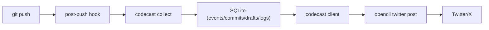

# CodeCast

[](#requirements)
[](#license)
[](#terminal-client)
[](#roadmap)

Turn every `git push` into a polished social update.

CodeCast listens to your push workflow, creates drafts from commit activity, and publishes through `opencli` after manual confirmation.

中文文档: [README.zh-CN.md](./README.zh-CN.md)

## Why CodeCast

- No more "I shipped a lot but posted nothing."
- Push-level aggregation (not noisy commit-by-commit spam).
- Terminal-first persistent client (`codecast`) with word commands.
- Manual confirmation before publish.
- Per-repo settings.
- Publish via `opencli` (Twitter/X and other adapters).

## Demo Flow (30 seconds)

1. Write code and `git push`.
2. Open `codecast` client.
3. Review draft, dry-run, publish.
4. Confirm and publish.

## Architecture



## UI Preview

Persistent terminal client (default entry: `codecast`):

```text
CodeCast client
single-focus home loaded

CodeCast
[status] pending=1 failed=0 selected=12
next: review
main: do    secondary: pending    menu: more
codecast(home)> do
codecast(review)> do
codecast(review)> do
```

## Features

- Push collection into local SQLite.
- Draft lifecycle: `PENDING -> FAILED/PUBLISHED -> ARCHIVED`.
- Style presets: `formal`, `friendly`, `punchy`.
- Multi-repo publish: `merged` or `separate`.
- Publish history and failed retry.
- Word commands + slash commands in one tool.

## Installation

### Option A: Install for current user (recommended)

```bash
python3 -m pip install --user /path/to/CodeCast
```

If `codecast` is not found, add this to your shell profile:

```bash
export PATH="$HOME/Library/Python/3.9/bin:$PATH"
```

### Option B: Run from source directly

```bash
cd /path/to/CodeCast
PYTHONPATH=src python3 -m codecast.cli
```

## Quick Start

Run once:

```bash
codecast setup
codecast init
codecast config set --key publish.opencli_cmd --value "opencli twitter post"
codecast install-hook --repo /path/to/your/repo
```

Or one-shot setup for a target repo:

```bash
codecast setup --repo /path/to/your/repo
```

Reset first-launch onboarding wizard:

```bash
codecast onboarding reset
```

Then in your dev repo:

```bash
git add .
git commit -m "feat: ship something"
git push
```

Open client:

```bash
codecast
```

Open web client (GUI MVP):

```bash
codecast web --host 127.0.0.1 --port 8765
```

Then visit `http://127.0.0.1:8765`.

## Terminal Client

`codecast` opens plain client mode by default (most stable across terminals).
Use `codecast cast` if you want panel mode.

Default startup is a single-focus home:
- one status line
- one recommended next action
- one secondary action (`pending`)
- one advanced entry (`more`)

You can always return to this home with `back`.

### Client Commands (word-based)

```text
do
more
back
help
help full
status
pending
all
select <id|latest>
show [id|latest]
style <formal|friendly|punchy> [id]
dry-run [id|latest]
publish [id|latest]
retry [id|latest]
history [id|latest] [limit]
setup
config
config set <key> <value>
exit
```

Use slash commands (`/pending`, `/post latest`, ...) anytime if you prefer.

## Slash Commands

```text
/pending
/all
/view <draft_id> [style]
/post <draft_id|latest> [--dry-run]
/retry <draft_id|latest> [--dry-run]
/history <draft_id|latest> [limit]
/repos <repo_a,repo_b> <merged|separate> [--dry-run]
/config show
/config set <key> <value>
/exit
```

## CLI Commands

```bash
codecast init
codecast setup --repo /repo/a
codecast onboarding status
codecast onboarding reset
codecast collect --repo /path/to/repo --oldrev <old_sha> --newrev <new_sha>
codecast drafts list --all
codecast drafts render --draft 1 --style friendly
codecast publish --draft 1 --dry-run
codecast publish --repos /repo/a,/repo/b --mode merged
codecast settings set --repo /repo/a --every-n-pushes 10 --default-style friendly
codecast install-hook --repo /repo/a
codecast ui --plain
codecast cast
codecast restart
codecast web --host 127.0.0.1 --port 8765
```

## Configuration

- `publish.opencli_cmd`: publish command (example: `opencli twitter post`)
- `publish.every_n_pushes`: per-repo aggregation threshold (`settings set --every-n-pushes`)
- `publish_enabled`: per-repo publish switch (`settings set --publish-enabled true|false`)
- `style.default`: per-repo default style (`settings set --default-style`)

## Requirements

- Python 3.9+
- Git
- `opencli` for real publishing
- Chrome + opencli Browser Bridge extension (for browser-backed adapters like Twitter/X)

## FAQ

### Why publish failed with "Extension is not connected"?

Your `opencli` daemon is running but Chrome extension is not connected.
Install/load the extension and run `opencli doctor` until it reports connected.

### Where is data stored?

Default database:

```text
~/.codecast/codecast.db
```

Override with:

```bash
CODECAST_DB_PATH=/custom/path/codecast.db
```

### Is auto-publish enabled?

No. MVP keeps manual confirmation before real publish.

## Roadmap

- Richer draft templates and prompt packs.
- Better onboarding wizard (`codecast setup`).
- Optional web UI on top of the same local DB.
- Plugin-style publisher backends.

## Contributing

Issues and PRs are welcome.  
If you propose UX changes, please include:

- before/after behavior
- keyboard flow impact
- command compatibility notes

For major changes, open an issue first so we can align on behavior and CLI compatibility.

See:

- [CONTRIBUTING.md](./CONTRIBUTING.md)
- [CODE_OF_CONDUCT.md](./CODE_OF_CONDUCT.md)

## License

[MIT](./LICENSE)
