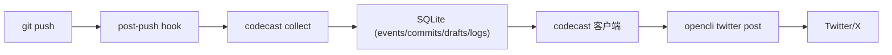

# CodeCast

[](#环境要求)
[](#许可证)
[](#终端客户端)
[](#路线图)

把每次 `git push` 变成可发布的开发动态。

CodeCast 会监听 push，聚合提交生成草稿，最后经人工确认后通过 `opencli` 发布到社交平台。

English: [README.md](./README.md)

## 为什么做 CodeCast

- 避免“功能做了很多，但没有及时对外同步”。
- 按 push 聚合，避免 commit 级别刷屏。
- 终端持续会话客户端（`codecast` 直接进入）。
- 发布前人工确认，降低误发风险。
- 支持按仓库配置。
- 通过 `opencli` 发布（可接 Twitter/X 等）。

## 30 秒体验流程

1. 正常开发并 `git push`
2. 输入 `codecast` 打开客户端
3. 查看草稿、dry-run、发布
4. 确认后发布

## 架构



## 功能特性

- push 采集并本地落库（SQLite）
- 草稿状态流转：`PENDING -> FAILED/PUBLISHED -> ARCHIVED`
- 三种文案风格：`formal` / `friendly` / `punchy`
- 多仓库发布：`merged` / `separate`
- 发布历史 + 失败重试
- 斜杠命令和面板操作并存

## 安装

### 方式 A：用户级安装（推荐）

```bash
python3 -m pip install --user /path/to/CodeCast
```

若提示 `codecast: command not found`，加入 PATH：

```bash
export PATH="$HOME/Library/Python/3.9/bin:$PATH"
```

### 方式 B：源码直接运行

```bash
cd /path/to/CodeCast
PYTHONPATH=src python3 -m codecast.cli
```

## 快速开始

首次执行一次：

```bash
codecast setup
codecast init
codecast config set --key publish.opencli_cmd --value "opencli twitter post"
codecast install-hook --repo /path/to/your/repo
```

也可以一条命令针对目标仓库初始化：

```bash
codecast setup --repo /path/to/your/repo
```

重置首次引导：

```bash
codecast onboarding reset
```

然后在你的开发仓库：

```bash
git add .
git commit -m "feat: ship something"
git push
```

打开客户端：

```bash
codecast
```

## 终端客户端

`codecast` 默认进入 plain 客户端模式（最稳定）。
如果你想要 panel 形态，执行 `codecast cast`。

默认启动是“单焦点首页”：
- 一行状态摘要
- 一个推荐下一步动作
- 一个次动作（`pending`）
- 一个高级入口（`more`）

你可以用 `back` 随时回到首页。

首次进入示例：

```text
CodeCast client
single-focus home loaded

CodeCast
[status] pending=1 failed=0 selected=12
next: review
main: do    secondary: pending    menu: more
codecast(home)> do
codecast(review)> do
```

### 单词命令（无单字母）

```text
do
more
back
help
help full
status
pending
all
select <id|latest>
show [id|latest]
style <formal|friendly|punchy> [id]
dry-run [id|latest]
publish [id|latest]
retry [id|latest]
history [id|latest] [limit]
setup
config
config set <key> <value>
exit
```

你也可以随时用斜杠命令（如 `/pending`、`/post latest`）。

## 斜杠命令

```text
/pending
/all
/view <draft_id> [style]
/post <draft_id|latest> [--dry-run]
/retry <draft_id|latest> [--dry-run]
/history <draft_id|latest> [limit]
/repos <repo_a,repo_b> <merged|separate> [--dry-run]
/config show
/config set <key> <value>
/exit
```

## CLI 命令

```bash
codecast init
codecast setup --repo /repo/a
codecast onboarding status
codecast onboarding reset
codecast collect --repo /path/to/repo --oldrev <old_sha> --newrev <new_sha>
codecast drafts list --all
codecast drafts render --draft 1 --style friendly
codecast publish --draft 1 --dry-run
codecast publish --repos /repo/a,/repo/b --mode merged
codecast settings set --repo /repo/a --every-n-pushes 10 --default-style friendly
codecast install-hook --repo /repo/a
codecast ui --plain
codecast cast
codecast restart
```

## 配置项

- `publish.opencli_cmd`：发布命令（例如 `opencli twitter post`）
- `publish.every_n_pushes`：按仓库设置聚合阈值
- `publish_enabled`：按仓库发布开关
- `style.default`：按仓库默认风格

## 环境要求

- Python 3.9+
- Git
- `opencli`（真实发布需要）
- Chrome + opencli Browser Bridge 扩展（Twitter/X 这类浏览器适配器需要）

## 常见问题

### 为什么发布报错 “Extension is not connected”？

`opencli` daemon 已启动，但 Chrome 扩展未连接。  
请安装并启用扩展，然后执行 `opencli doctor` 直到显示 connected。

### 数据存在哪里？

默认：

```text
~/.codecast/codecast.db
```

可通过环境变量覆盖：

```bash
CODECAST_DB_PATH=/custom/path/codecast.db
```

### 默认会自动真发吗？

不会。MVP 默认是人工确认后才真实发布。

## 路线图

- 更丰富的文案模板和风格包
- 新手引导命令（`codecast setup`）
- 基于同一 DB 的可选 Web UI
- 可插拔发布后端

## 贡献

欢迎提 Issue 和 PR。  
如果改动交互体验，请附上：

- 改动前后行为
- 键位/流程影响
- 命令兼容性说明

详细说明见：

- [CONTRIBUTING.md](./CONTRIBUTING.md)
- [CODE_OF_CONDUCT.md](./CODE_OF_CONDUCT.md)

## 许可证

[MIT](./LICENSE)
